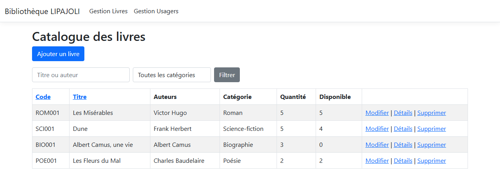
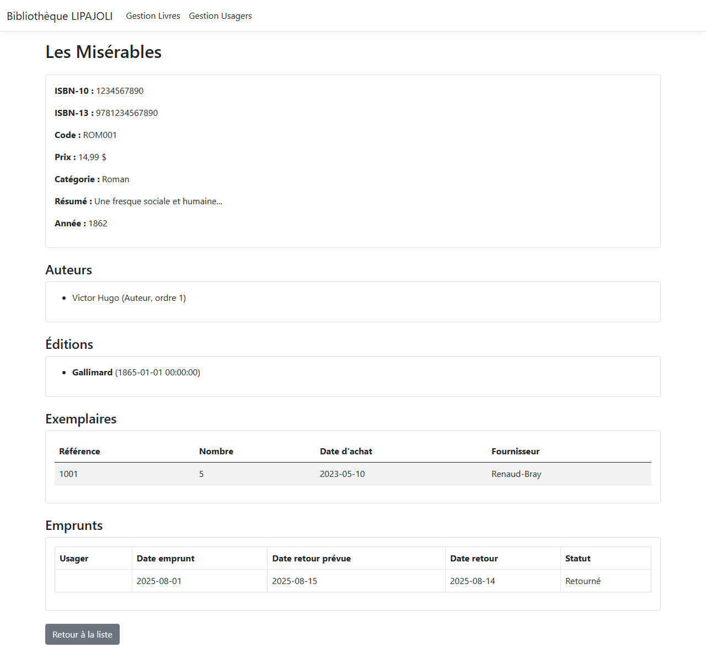
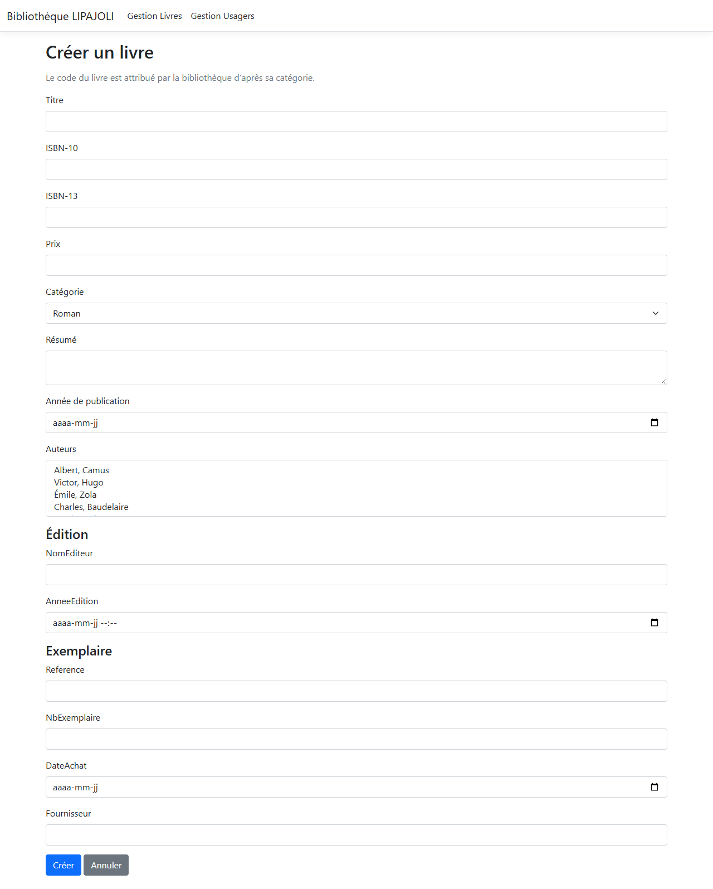
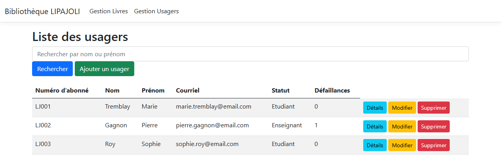
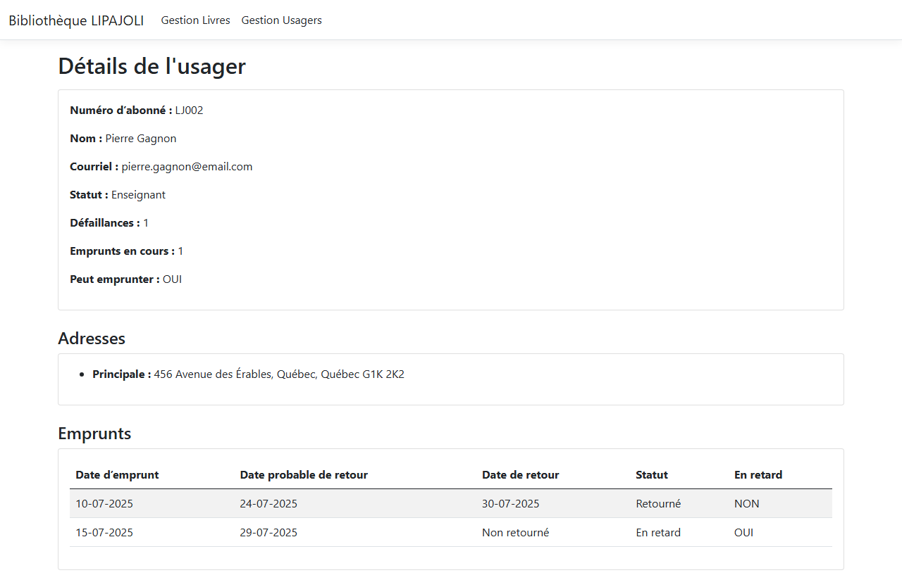
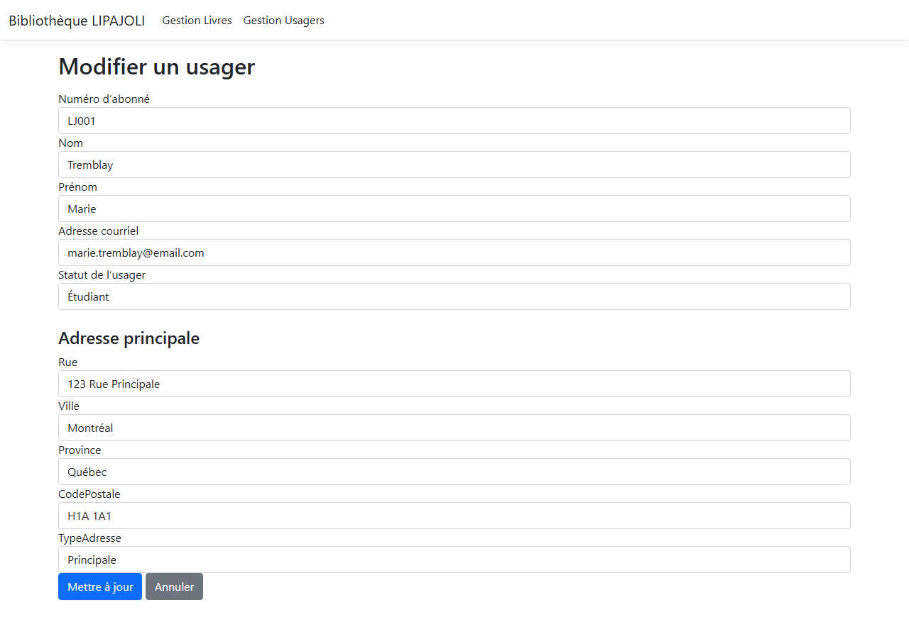

# bibliotheque-lipajoli

[](https://github.com/Arthure-code/bibliotheque-lipajoli/actions/workflows/build.yml)
[](https://sonarcloud.io/summary/new_code?id=Arthure-code_bibliotheque-lipajoli)
[](https://sonarcloud.io/summary/new_code?id=Arthure-code_bibliotheque-lipajoli)
[](https://sonarcloud.io/summary/new_code?id=Arthure-code_bibliotheque-lipajoli)
[](https://sonarcloud.io/summary/new_code?id=Arthure-code_bibliotheque-lipajoli)
[](https://sonarcloud.io/summary/new_code?id=Arthure-code_bibliotheque-lipajoli)
[](https://sonarcloud.io/summary/new_code?id=Arthure-code_bibliotheque-lipajoli)
[](https://sonarcloud.io/summary/new_code?id=Arthure-code_bibliotheque-lipajoli)

A library counter: books on the shelves, members with a file, and the loans
between them. A book is catalogued and given a code, a member is registered and
followed, and the file remembers who returned late.

ASP.NET Core 8 MVC, Entity Framework Core 8, SQLite. The site is in French.

## Screenshots

**The catalogue**



**A book**



**Cataloguing a book**



**The members**



**A member file**



**Editing a member**



## How it works

**A book code is assigned, never typed.** Three letters from the category and a
three-digit sequence of its own: PRO001, PRO002, RES001. The form does not ask
for it, a posted code is refused at binding, and the column carries a unique
index. The rule itself is a pure function of the category name and the codes
already given.

**A price is read the same way on both sides of the Atlantic.** 18,50 and 18.50
give the same number, and so do 1 234,56, 1,234.56 and 1.234,56. What cannot be
decided is refused rather than guessed: 10,000 means ten thousand to one reader
and ten to another, so the form asks again instead of storing one of the two.
Whatever is typed, the column holds a single form.

**A failure is a late return, not a loan in progress.** The counter starts at
zero when the member registers, no form can write it, and only a return past
the limit date increases it. Three failures and the member stops borrowing,
three loans in hand and they stop too. The loan duration comes from the
configuration file, not from the code.

**Identifiers come from the address bar.** The keys refuse model binding, so a
posted identifier cannot send a save to another file, and the update reads the
key from the route.

**Authors and categories are not in the database.** They are read once from the
configuration at startup. Searching an author resolves the names in memory,
without accents or case, then keeps the books they signed.

**A member, their address and the link between them are written together.** One
save, or nothing: a failure halfway leaves no orphan address behind.

**The controllers never see the database.** They hold an interface, the service
behind it holds the context. That is what makes the controllers testable with
nothing but mocks.

## Running it

```bash
cd BibliothequeLIPAJOLI
dotnet run
```

The SQLite file is created by the migrations on the first run and filled with
four books, three members, their addresses, editions, copies and loans. Delete
`bibliotheque.db` to start over.

```bash
dotnet test
```

## Résumé

Comptoir de bibliothèque en ASP.NET Core 8 MVC avec Entity Framework Core et
SQLite. Un livre reçoit son code de la bibliothèque, trois lettres de sa
catégorie et une séquence propre à celle-ci, et ce code n'est ni saisi ni
modifiable. Un prix s'écrit avec une virgule ou un point et arrive en base sous
une seule forme ; une écriture ambiguë est refusée plutôt que devinée. La
défaillance d'un usager compte ses retours en retard, part de zéro, ne se
saisit pas, et trois défaillances l'empêchent d'emprunter, comme trois emprunts
en cours. Les identifiants viennent de l'adresse et jamais du formulaire. Les
auteurs, les catégories et la durée d'un prêt sont lus dans la configuration.
Les contrôleurs ne connaissent que des interfaces, les services parlent seuls à
la base, et cent soixante tests unitaires vérifient les règles, les
annotations, la lecture des nombres et les contrôleurs avec des mocks.

## Licence

MIT. See [LICENSE](LICENSE).
